# kibochat

> A personalized ChatGPT clone built on [nanochat](https://github.com/karpathy/nanochat)

This is **kibochat** (codename "Kibo") - my personal LLM trained from scratch during a 48-hour hackathon. Built on Andrej Karpathy's [nanochat](https://github.com/karpathy/nanochat) framework.

## Background

I built this at the [TSFM (Toronto School of Foundation Modelling)](https://www.tsfm.ca/) hackathon. Two days, no sleep, one goal: train my own language model from scratch and actually understand what's happening under the hood.

### The Journey

**Night 1: The crashes.** My first few runs died. I'd watch the loss curve for an hour, step away for coffee, come back to a CUDA out-of-memory error. No checkpoints. Progress gone. That's when I learned why checkpointing matters - not from a textbook, but from losing 3 hours of compute at 2am. I burned through 40+ GPU hours just on base training, most of it on failed runs.

**Night 2: Stability.** By the second night, I had the pipeline stable. Watching the validation BPB tick down from 0.827 to 0.816 over thousands of steps - that's when it clicked. This wasn't magic. It was matrix multiplications, gradient updates, and patience.

**The experiment.** After getting the base model working, I wanted to see if custom data actually helps. I generated 1000 synthetic conversations via Gemini 2.5 Flash teaching the model its identity - who it is, who built it, how to respond. Then I ran SFT twice: once with Karpathy's base setup, once with my synthetic data mixed in. Result: **MMLU improved 1.5%** and train loss dropped 62%. Small dataset, measurable impact.

**The moment.** When I finally asked it "who are you?" and it answered "I'm Kibo, created by Kirill" - that was it. I'd trained a language model from scratch that knew who it was.

### What I Learned

- **The full pipeline**: pretraining (learn language) → midtraining (adapt to domain) → SFT (learn to chat)
- **Checkpointing isn't optional** - learned this by losing hours of progress
- **Distributed training**: PyTorch DDP across 8 GPUs, gradient accumulation when memory is tight
- **Synthetic data works**: 1000 conversations measurably improved benchmarks
- **Loss curves tell the story**: validation BPB is the real signal, not training loss

## Training Results

### Final Metrics

| Stage | Steps | Final Loss | Key Results |
|-------|-------|------------|-------------|
| Base Pretraining | 21,400 | 2.68 | CORE: 0.211, BPB: 0.816 |
| Midtraining | 810 | 1.24 | BPB: 0.397 |
| SFT | 700 | 0.48 | ARC-Easy: 47.9%, MMLU: 35.5% |

### Custom Synthetic Data Experiment

I ran SFT twice: once with Karpathy's base setup (blue), then again with 1000 synthetic identity conversations generated via Gemini 2.5 Flash (red).

| Metric | Base Setup | + 1K Synthetic | Change |
|--------|-----------|----------------|--------|
| MMLU | 34.1% | 35.5% | **+1.5%** |
| ARC-Easy | 47.5% | 47.9% | +0.4% |
| Train Loss | 1.27 | 0.48 | -62% |

**MMLU Accuracy** - Red (with synthetic data) consistently outperforms blue (base)
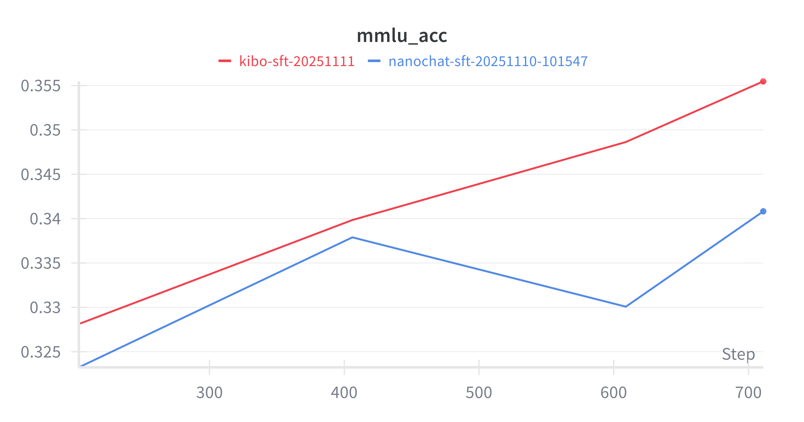

**SFT Training Loss** - Both noisy, but red trends lower by end of training
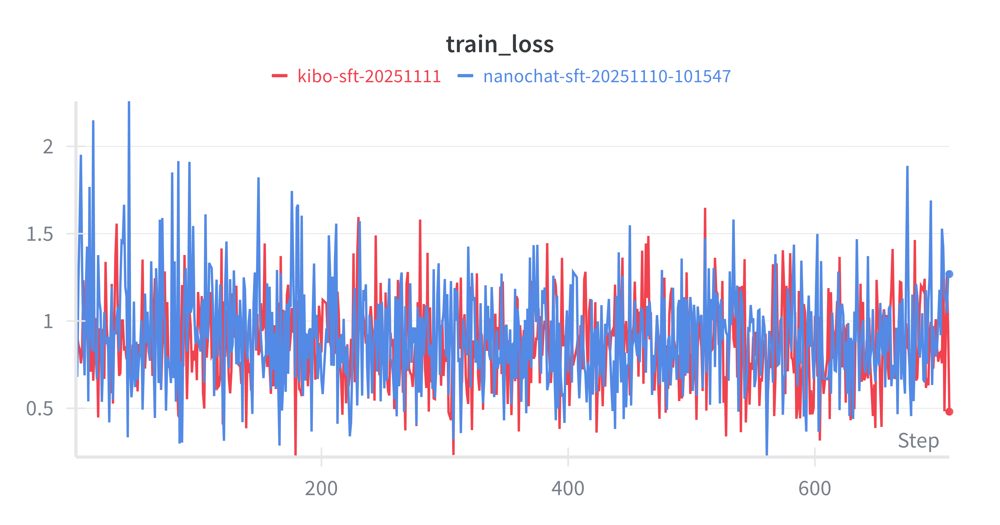

**Midtraining Loss** - Nearly identical, as expected (synthetic data is small fraction)


The synthetic data improved benchmark scores while teaching the model its identity. The dramatic train loss reduction shows the model successfully learned the custom personality data.

### Infrastructure

- **Compute**: [Modal](https://modal.com/) cloud GPUs (8xH100)
- **Total cost**: ~$230 (from $500 TSFM credits)
- **Training time**: ~41 hours total (including crashes and restarts)
- **Model**: 1.9B parameters, d20 (20-layer Transformer)

---

## Training Curves

All metrics tracked on [Weights & Biases](https://wandb.ai/kiborisov-asc42-com). Charts below show the final runs (with synthetic data).

### Stage 1: Base Pretraining

The foundation - training on FineWeb dataset to learn language patterns.

**Training Loss** - Started high, steadily decreased as the model learned
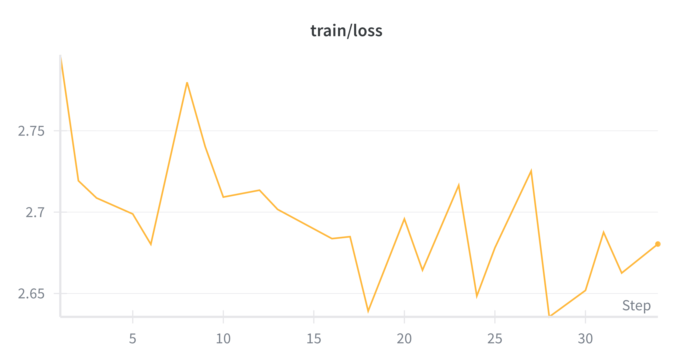

**Validation BPB (Bits Per Byte)** - The real measure of generalization: 0.827 → 0.816
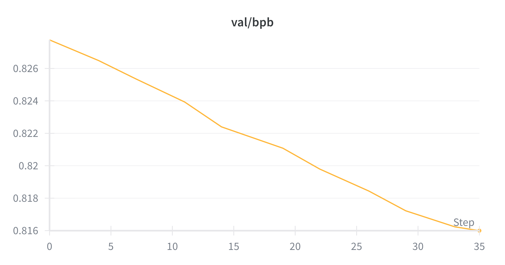

**GPU Utilization (MFU)** - Sustained ~21% model FLOP utilization across 8xH100
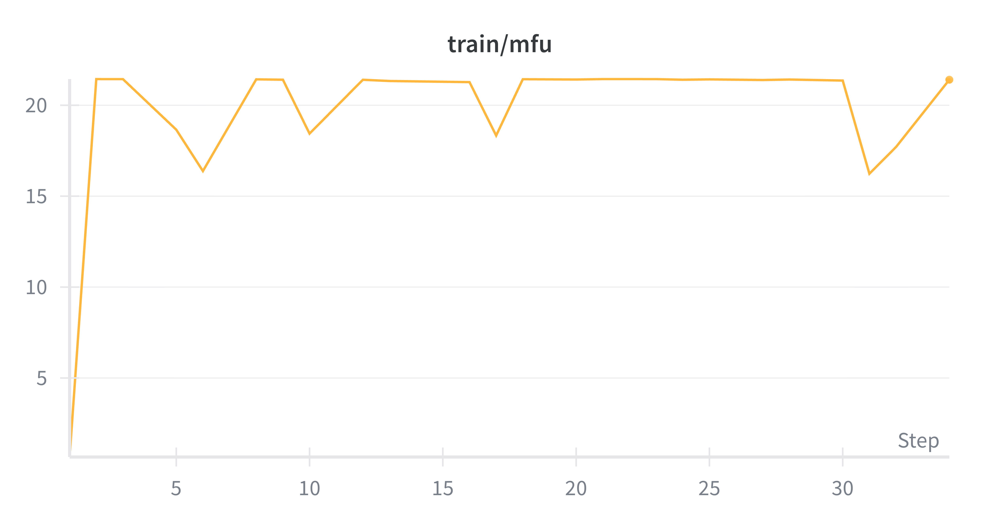

**Throughput** - ~240K tokens/sec training speed
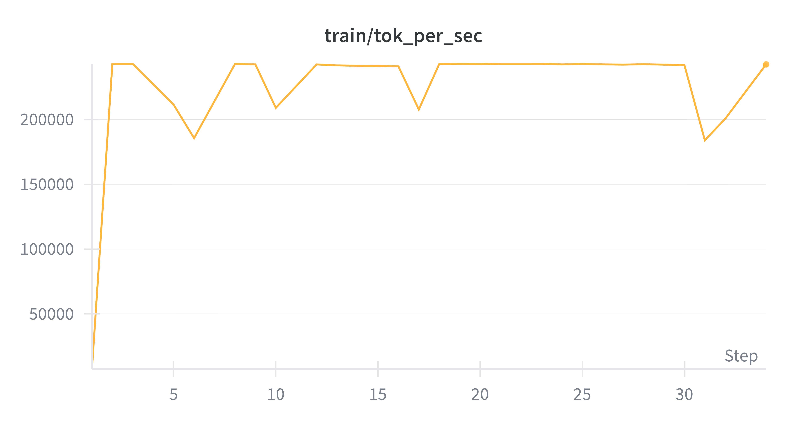

---

### Stage 2: Midtraining

Domain adaptation with chat-style data and custom identity conversations.

**Training Loss** - Sharp drop from 1.9 → 1.24 as model adapts to conversational format
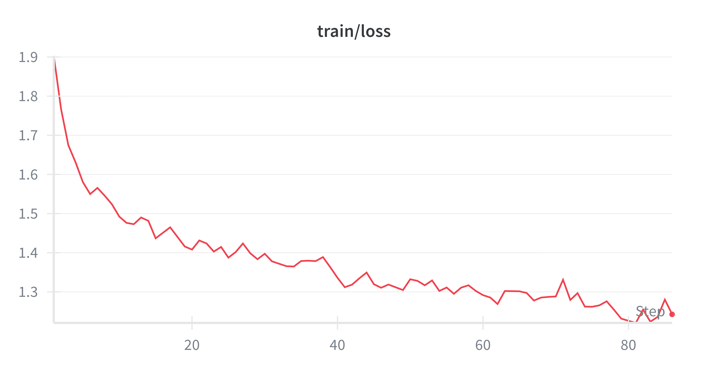

**Validation BPB** - Dramatic improvement: 0.70 → 0.40
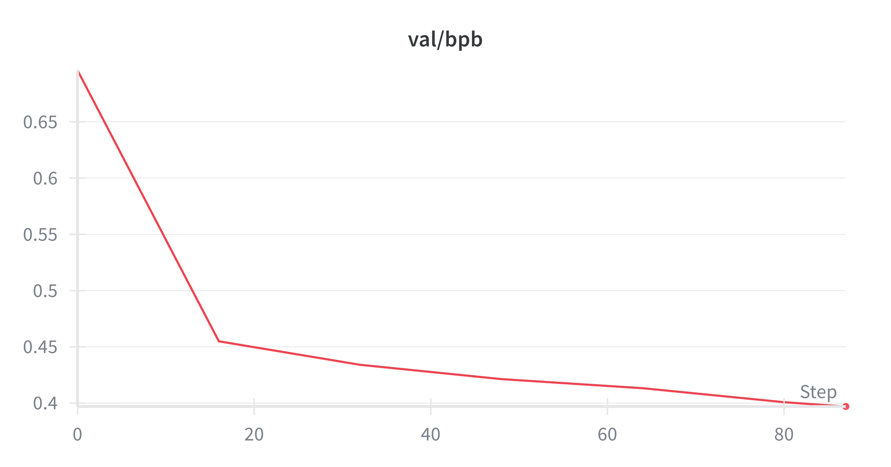

---

### Stage 3: Supervised Fine-Tuning (SFT)

Final polish - teaching the model to follow instructions and maintain identity.

**Training Loss** - Noisy but trending down (expected for small-batch SFT)
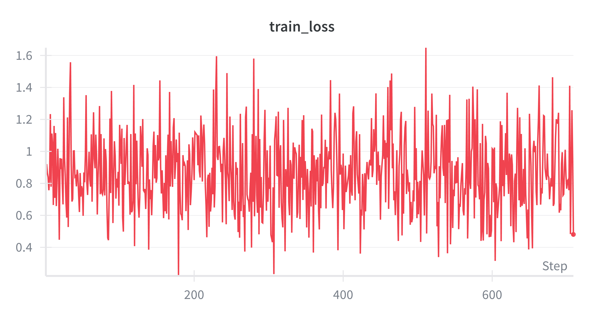

**Validation Loss** - Stable convergence around 1.0
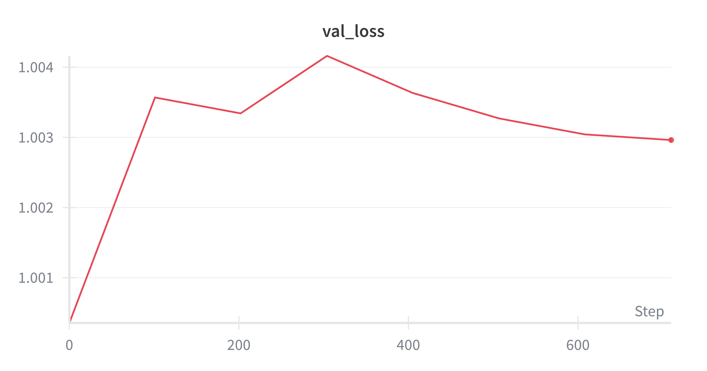

**MMLU Accuracy** - Benchmark performance: 32.8% → 35.5% (see comparison above for base vs synthetic)
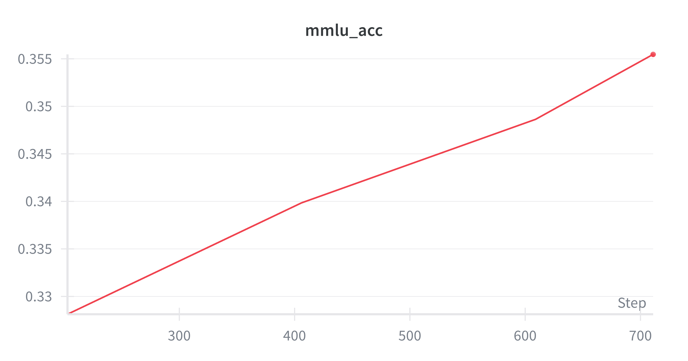

---

## What is this?

kibochat is a complete pipeline for training and deploying a personalized LLM:

- **Tokenization**: Custom BPE tokenizer (Rust + Python)
- **Pretraining**: Base model training on FineWeb dataset
- **Midtraining**: Domain adaptation and identity injection
- **SFT**: Supervised fine-tuning for chat capabilities
- **Inference**: Efficient KV-cache inference engine
- **Deployment**: Web UI and CLI interfaces

## Quick Start

### Prerequisites
- Python 3.10+
- [uv](https://github.com/astral-sh/uv) package manager
- GPU with 80GB VRAM (8xH100 recommended) for full training
- For inference only: Any CUDA GPU or CPU/MPS

### Setup

```bash
git clone https://github.com/kiborisov/kibochat.git
cd kibochat
uv sync
source .venv/bin/activate
```

### Training

```bash
# Full training (~$100, 4 hours on 8xH100)
bash speedrun.sh

# Or in a screen session
screen -L -Logfile speedrun.log -S speedrun bash speedrun.sh
```

### Chat with your model

```bash
# Web UI
python -m scripts.chat_web

# CLI
python -m scripts.chat_cli
```

## Project Structure

```
kibochat/
├── nanochat/           # Core library (model, tokenizer, inference)
├── scripts/            # Training & inference scripts
├── tasks/              # Evaluation benchmarks (ARC, MMLU, GSM8K, HumanEval)
├── rustbpe/            # Rust BPE tokenizer
├── tests/              # Unit tests
├── speedrun.sh         # $100 training script
└── run1000.sh          # $800 training script
```

## Customization

To give your model a custom identity:

```bash
export OPENROUTER_API_KEY=your_key
python dev/gen_synthetic_data.py
```

This generates synthetic conversations that get mixed into midtraining and SFT.

## Acknowledgements

Built during [TSFM (Toronto School of Foundation Modelling)](https://www.tsfm.ca/) hackathon.

Core architecture from [nanochat](https://github.com/karpathy/nanochat) by Andrej Karpathy.

Thanks to:
- [Modal](https://modal.com/) for $500 in GPU credits via TSFM
- [HuggingFace](https://huggingface.co/) for FineWeb and SmolTalk datasets
- [modded-nanoGPT](https://github.com/KellerJordan/modded-nanogpt) for training optimizations

## License

MIT
